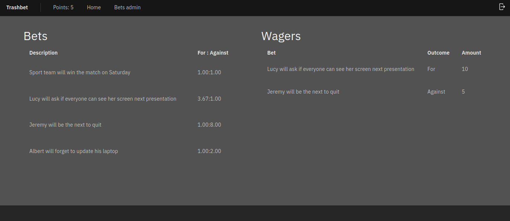

# TrashBet
[SaltyBet](https://www.saltybet.com/) - style betting system but in Kotlin-Ktor



## Features
* create bets with a binary outcome
* place wagers on bets with working odds calculation
* working payouts
* REST API
* session auth
* admin role

## Stack
* Front end
  * [`sveltejs`](https://svelte.dev/) framework because it looked lighter than `react`
  * [`carbon-components-svelte`](https://github.com/IBM/carbon-components-svelte) ui components
  * `app/web`
* Back end
  * [`ktor`](https://ktor.io/) microservice framework
  * [`exposed`](https://github.com/JetBrains/Exposed) orm
  * `app/src/main/kotlin/trashbet`
* Ops
  * scripts in `bin`
  * single `Dockerfile` for the web tier
  * compose setup for web and postgres db

## Deploying
```sh
# setup app/web/.env
./bin/set-environment.sh
./bin/docker-build.sh
docker-compose up
# first signup will be an admin
```
app available on port 8080

## Running locally
### Configuration
Environment variables
```sh
TRASHBET_PORT = 8080
TRASHBET_ENVIRONMENT = testing
```

### API
```sh
# boot up a local db
./dev-db-run.sh
./gradlew run
```
health [endpoint](http://localhost:8080/health)

web bundle is also being served on this port at the webroot

[api spec](./app/src/test/kotlin/trashbet/AppTest.kt) `¯\_(ツ)_/¯`

### Web
create `app/web/.env`
```sh
API_ENDPOINT=http://localhost:8080
```
then run
```sh
# from ./app/web
npm install
npm run dev
```
available on [port 5000](http://localhost:5000/)

### Tests
```
./gradlew test
```

## Contributors
[JoelPagliuca](https://github.com/JoelPagliuca)
