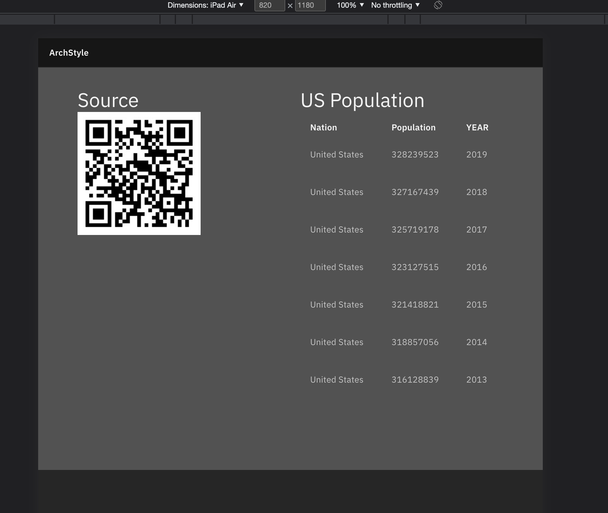
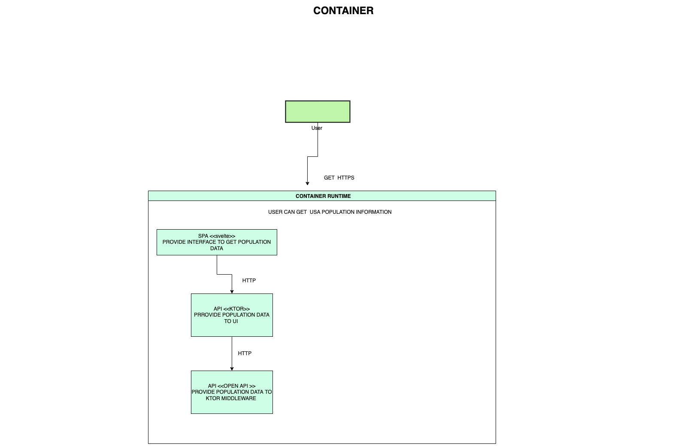
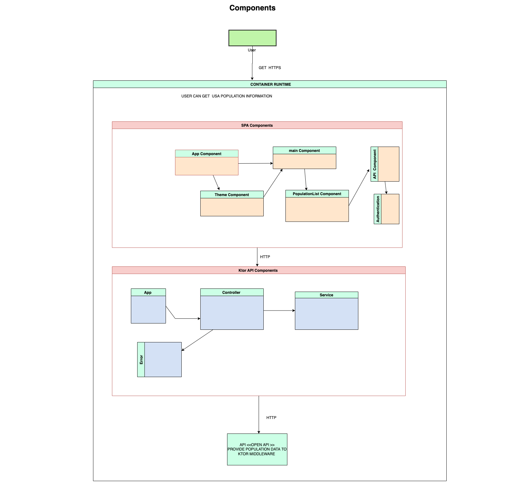

# Architecture With Kotlin-Ktor and SvelteJS



## Features

* Showing data frrom open API on US Population  
* Showing Auto Generated QR code 
*  Why Ktor  - Create asynchronous client and server applications. Anything from microservices to multiplatform HTTP client apps in a simple way. Open Source, free, and fun!
*  Why SvelteJS - 
Svelte is popular for being faster than any other library. This is due to shifting the step of loading a framework intended for building a virtual DOM. Rather than using a tool during the running process, it is compiled to JS during the building stage. This means that the application needs no dependencies to start.
* AI/ ML 
* REST API

## Stack
* Front end
  * [`sveltejs`](https://svelte.dev/) Compliled version / Faster than Vue and React .
  * [`carbon-components-svelte`](https://github.com/IBM/carbon-components-svelte) ui components. Best for Accesibility
  * `app/web`
* Back end
  * [`ktor`](https://ktor.io/) non I/O blocking  microservice framework 
  * `app/src/main/kotlin/archstyle`
* Ops
  * scripts in `bin`
  * single `Dockerfile` for the web tier
  * compose setup for web and postgres db

## Deploying
```sh
# setup app/web/.env
./bin/set-environment.sh
./bin/docker-build.sh
docker-compose up
# first signup will be an admin
```
app available on port 8080

## Running locally
### Configuration
Environment variables
```sh
ARCHSTYLE_PORT = 8080
ARCHSTYLE_ENVIRONMENT = testing
```

### API
```sh
# boot up a local db
./dev-db-run.sh
./gradlew run
```
health [endpoint](http://localhost:8080/health)

web bundle is also being served on this port at the webroot

[api spec](./app/src/test/kotlin/archstyle/AppTest.kt) `¯\_(ツ)_/¯`

### Web
create `app/web/.env`
```sh
API_ENDPOINT=http://localhost:8080
```
then run
```sh
# from ./app/web
npm install
npm run dev
```
available on [port 5000](http://localhost:5000/)

### Tests
```
./gradlew test
```






## Contributors
[Bidit Pakrashi](https://github.com/BiditPakrashi/)


